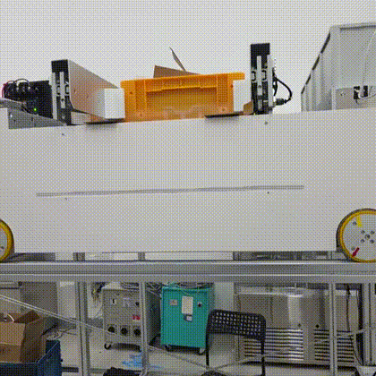
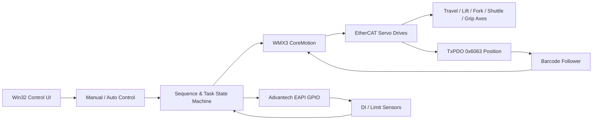

# 4-Way Shuttle Motion Control System

> **C++ / Win32 / WMX3 / EtherCAT 기반 4-Way Shuttle 실장비 제어 프로젝트**  
> 다축 모션, 바코드 기반 정밀 정차, 센서 인터록, GPIO, 자동 시퀀스를 하나의 제어 애플리케이션으로 통합했습니다.

<p align="left">
  
  
  
  
  
</p>

---

## Portfolio Snapshot

| 구분 | 내용 |
|---|---|
| **Project** | 4-Way Shuttle 실장비 Motion Control & Automation |
| **Role** | Motion / I/O / Sequence Control Software Development |
| **Language** | C++17 |
| **UI** | Win32 API |
| **Motion API** | SoftServo WMX3 / CoreMotion |
| **Fieldbus** | EtherCAT, TxPDO `0x6063` position feedback |
| **I/O** | Advantech Platform SDK EAPI GPIO |
| **Control Scope** | 주행, 승강, Forking, Shuttle 전후진, Gripper, 센서/리밋, 자동 시퀀스 |
| **Key Point** | 센서 상태와 현재 위치를 기반으로 목적지까지 필요한 동작을 조합하는 상태 기반 자동화 |

### 한 줄 요약

**“모터를 움직이는 코드”에서 끝나지 않고, 실제 센서·리밋·바코드·GPIO 상태를 묶어 4-Way Shuttle이 스스로 다음 동작을 결정하도록 만든 장비 제어 프로젝트입니다.**

---

## 🎥 Robot Demo Video

실제 4-Way Shuttle 실장비 구동 영상을 포트폴리오에 포함했습니다. **아래 GIF를 클릭하면 전체 동작 영상으로 이동합니다.**

[](./assets/videos/4way_shuttle_full_demo.mp4)

### Full Operation Demo

- **Video**: [`assets/videos/4way_shuttle_full_demo.mp4`](./assets/videos/4way_shuttle_full_demo.mp4)
- **Length**: 약 **1분 11초**
- **Format**: H.264 MP4, GitHub/브라우저 재생 호환성을 고려한 포트폴리오용 변환본
- **Preview**: `assets/images/demo.gif`

#### 영상에서 확인할 수 있는 내용

- 실제 4-Way Shuttle의 레일 주행과 위치 이동
- Shuttle 상부 이송부 및 적재물 처리 동작
- 장비가 여러 위치를 이동하며 수행하는 연속 동작
- 코드에서 구현한 **Motion / Sensor / Sequence 제어가 실장비에서 동작하는 결과**

> 포트폴리오 검토 시에는 GIF로 전체 동작을 빠르게 확인한 뒤, 전체 영상을 통해 실제 장비 동작을 확인할 수 있도록 구성했습니다.

## Why I Built This

4-Way Shuttle은 단일 축 제어만으로 움직일 수 있는 장비가 아닙니다. 주행 위치, 승강 상태, 전후진 위치, Fork 상태, 리밋 센서가 서로 얽혀 있기 때문에 **현재 장비 상태를 먼저 판단하고 안전한 순서로 여러 축을 조합**해야 합니다.

이 프로젝트에서는 다음 문제를 제어 소프트웨어 관점에서 해결했습니다.

- 여러 축의 Servo / Position Mode / Move / Stop 제어
- EtherCAT 위치 피드백을 이용한 바코드 기반 정차
- 빠른 접근 후 저속 보정으로 이어지는 2단계 위치 결정
- Limit / DI 센서를 이용한 동작 완료 판정
- GPIO 입출력 및 디바운싱
- 현재 위치에 따라 달라지는 목적지 이동 시퀀스
- Manual / Auto 동작 분리 및 인터록
- 작업 상태를 `Idle / Running / Done / Failed / Stopped`로 관리
- 장비 상태 확인을 위한 Win32 제어 UI 및 모니터링 기능

---

## System Architecture



### Control concept

```text
현재 센서/위치 읽기
        ↓
현재 장비 상태 판정
        ↓
목표 위치와 비교
        ↓
필요한 축 동작만 순차 실행
        ↓
센서 + 위치 + 속도 기반 완료 판정
        ↓
다음 동작 또는 Done / Failed
```

---

## Key Engineering Highlights

### 1. Barcode-based precision positioning

주행 위치는 EtherCAT TxPDO의 `0x6063` 값을 읽어 목표 바코드 위치와 비교합니다.

`BarcodeFollower`에서는 단순히 목표값까지 한 번 이동시키는 방식 대신 다음과 같이 정차 품질을 높이는 흐름을 구성했습니다.

1. 목표 방향 및 오차 계산
2. 고속 Coarse 이동
3. 감속 구간 진입
4. 저속 Fine correction
5. 위치 오차와 속도를 함께 확인
6. 안정적으로 정지한 경우 Task 완료 처리

프로젝트 코드에는 4-Way Shuttle의 주요 주행 지점이 바코드 기준값으로 구성되어 있으며, 예를 들어 Left / Workstation / Right 지점을 각각 구분해 이동합니다.

**관련 코드**

- `DemoControl.cpp` → `BarcodeFollower`
- `GoLeft()`
- `GoWorkstation()`
- `GoRight()`
- `ReadAxis_TxPDO_6063()` 연계

### 2. Two-stage approach profile

정밀 정차가 필요한 축은 `StartMoveWithApproach()`를 통해 **빠른 이동 + 저속 접근** 방식으로 제어합니다.

```text
Fast Move
   ↓
Approach Zone 진입
   ↓
Soft / Slow target 갱신
   ↓
Final Target
   ↓
Position + Velocity 검증
```

이를 통해 단순한 고속 Position Move보다 실제 장비에서 발생할 수 있는 오버슈트와 정차 충격을 줄이도록 설계했습니다.

### 3. State-aware destination sequence

`GoOne()` ~ `GoFive()` 자동 이동 함수는 현재 위치가 어디인지 먼저 판정합니다.

예를 들어 현재 상태가 Center인지, Left인지, Right인지, Forward 위치인지에 따라 필요한 동작만 조합합니다.

```cpp
PosFlags f = ReadPosFlags();

if (f.isCenter) {
    GoLeft();
    Down();
    Forward();
}
else if (f.isRightForward) {
    Backward();
    Up();
    GoLeft();
    Down();
    Forward();
}
```

즉, **고정된 매크로를 무조건 재생하는 것이 아니라 현재 상태에서 목표 상태까지 필요한 경로를 선택**합니다.

### 4. Sensor & limit based completion

실장비에서는 명령을 보냈다는 사실보다 **실제로 장비가 원하는 상태에 도달했는지**가 중요합니다.

이 프로젝트에서는 다음 조건들을 조합해 동작 완료를 판정합니다.

- Axis actual position
- Axis actual velocity
- Up / Down limit
- Shuttle position limits
- Box detection
- GPIO DI state
- Barcode position

일부 복귀 동작은 단순 Target Position이 아니라 **Limit Sensor 감지 → Stop → Idle 확인 → Home/Next Action** 흐름으로 처리합니다.

### 5. GPIO debounce and hardware I/O

Advantech EAPI를 이용해 DI / DO를 제어하고, 센서 노이즈가 상태 판정에 직접 반영되지 않도록 다중 샘플 기반 디바운싱 로직을 구성했습니다.

주요 기능은 다음과 같습니다.

- GPIO bank 탐색
- DI0~DI7 입력 모니터링
- DO8~DO15 출력 제어
- 출력 방향 자동 설정
- Majority sampling 기반 DI 안정화
- UI toggle과 실제 Hardware I/O 동기화

### 6. Task state management

모든 주요 동작은 공통 상태를 사용합니다.

```cpp
enum class TaskState {
    Idle,
    Running,
    Done,
    Failed,
    Stopped
};
```

`WaitTaskFinished()`와 `WaitUntil()`을 사용해 여러 동작을 순차적으로 연결하며, Timeout 또는 조건 실패 시 다음 동작을 진행하지 않도록 했습니다.

### 7. Manual / Auto separation & interlock

수동 조작과 자동 운전의 명령 경로를 분리해 Auto 상태에서 임의 Manual command가 들어오는 것을 방지합니다.

장비 운전에서는 UI 편의성보다 오동작 방지가 우선이므로, 각 축 명령 전 통신 상태, Servo 상태, 센서 상태 및 동작 중 여부를 검사하는 구조를 적용했습니다.

---

## Main Motion Functions

| Function | Purpose |
|---|---|
| `GoLeft()` | 바코드 기반 Left 위치 이동 |
| `GoWorkstation()` | 바코드 기반 Workstation 이동 |
| `GoRight()` | 바코드 기반 Right 위치 이동 |
| `Forward()` / `Backward()` | Shuttle 전후진 |
| `Forking()` / `Unforking()` | Fork 동작 |
| `Up()` / `Down()` | 승강 동작 |
| `HoistUp()` / `HoistDown()` | Hoist 위치 제어 |
| `Open()` / `Close()` | Gripper 제어 |
| `GoOne()` ~ `GoFive()` | 현재 상태 기반 목적지 자동 시퀀스 |
| `DoStopAll()` | 전체 동작 정지 |

---

## Software Structure

```text
4way_shuttle-master/
├─ oht_main.cpp          # Main Win32 UI, WMX3 initialization, motion tools,
│                        # Auto/Manual mode, monitoring, communication logic
├─ DemoControl.cpp       # Shuttle motion functions, barcode follower,
│                        # sensor logic, automatic sequences, GPIO integration
├─ DemoShared.h          # Shared task / motion declarations
├─ GPIO_Control.cpp      # Advantech EAPI GPIO diagnostic/control UI
├─ MapView.cpp/.h        # 5-station graphical map / robot position visualization
├─ fastech_errors.json   # Fastech error reference data
├─ welcon_errors.json    # Welcon error reference data
├─ OHT.sln               # Visual Studio solution
├─ OHT.vcxproj           # C++ project configuration
└─ assets/
   ├─ videos/            # Robot operation videos
   └─ images/            # GIF / screenshot / thumbnail
```

---

## Tech Stack

### Software

- **C++17**
- **Win32 API**
- **Visual Studio / MSVC v143**
- **Winsock2**
- Multithreading with `std::thread`
- Atomic state management with `std::atomic`

### Motion / Hardware

- **SoftServo WMX3**
- **CoreMotion API**
- **EtherCAT / EcApi**
- EtherCAT object / TxPDO position feedback (`0x6063`)
- **Advantech Platform SDK EAPI**
- GPIO DI / DO
- Servo / Limit / Position sensors

---

## Build Environment

프로젝트 파일 기준 개발 환경은 다음과 같습니다.

- Windows 10/11
- Visual Studio with **Platform Toolset v143**
- C++17
- WMX3 installed under the configured SDK path
- Advantech Platform SDK EAPI

프로젝트 설정에는 다음 SDK 경로가 사용됩니다.

```text
C:\Program Files\SoftServo\WMX3\Include
C:\Program Files\SoftServo\WMX3\Lib
C:\Program Files\Advantech\PlatFormSDK\EAPI\include\API
```

> 실제 실행에는 WMX3 Runtime, EtherCAT slave 구성, Servo drive, GPIO board 등 대상 장비 환경이 필요합니다.

---

## What This Project Demonstrates

이 프로젝트를 통해 다음 역량을 보여줄 수 있습니다.

- 실제 산업용 로봇 / 물류 장비의 **다축 Motion Control**
- Servo API와 EtherCAT feedback을 결합한 **Closed-loop 동작 판단**
- 센서 / 리밋 / GPIO 기반 **장비 인터록 설계**
- 현재 상태에 따라 다음 행동을 결정하는 **Sequence Control**
- Timeout / Failed / Stop을 포함한 **예외 상황 처리**
- Hardware debugging을 위한 **Win32 monitoring UI**
- 실장비 튜닝을 고려한 **속도·가감속·정밀 접근 로직**

---

## Troubleshooting / Engineering Decisions

### 정밀 정차 문제

**Issue**  
고속 이동만으로 목표 위치를 맞추면 실제 장비 관성과 sampling delay 때문에 목표점 근처에서 오버슈트 또는 반복 보정이 발생할 수 있습니다.

**Approach**  
Coarse / Fine 단계를 분리하고 목표 근처에서 correction speed를 낮추는 방식으로 정차 로직을 구성했습니다.

### 센서 순간값 문제

**Issue**  
DI 신호의 순간 변화가 장비 상태 판정으로 바로 전달되면 잘못된 다음 동작이 실행될 수 있습니다.

**Approach**  
다중 sampling과 majority 판정을 사용해 안정화된 DI 상태를 사용했습니다.

### 복합 위치 이동 문제

**Issue**  
4-Way Shuttle은 같은 목적지라도 현재 위치와 승강 상태에 따라 필요한 동작 순서가 달라집니다.

**Approach**  
`PosFlags`로 현재 기구 상태를 먼저 추상화한 뒤, 목적지 함수에서 상태별 경로를 선택하도록 구성했습니다.

---

## Notes for Portfolio Reviewers

이 저장소는 **실장비 제어용 프로젝트**이므로 일반 PC 환경에서는 Hardware SDK 및 EtherCAT 장비 없이 전체 동작을 재현하기 어렵습니다.  
대신 README의 구조와 실제 소스 코드를 통해 **Motion API → Sensor feedback → State judgement → Automatic sequence**로 이어지는 제어 구조를 확인할 수 있습니다.

---

## Demo Media Checklist

포트폴리오 제출 전 아래 자료를 추가하면 프로젝트 전달력이 더 좋아집니다.

- [x] 전체 로봇 주행 영상
- [ ] Left / Center / Right 이동 영상
- [ ] Shuttle Forward / Backward 영상
- [ ] Forking / Unforking 영상
- [ ] 자동 목적지 시퀀스 영상
- [ ] 제어 프로그램 UI 캡처
- [ ] EtherCAT / Servo 장비 사진

---

### Keywords

`Robotics` `Motion Control` `C++` `WMX3` `EtherCAT` `Servo` `Win32` `GPIO` `Automation` `4-Way Shuttle` `Material Handling` `Sequence Control`
